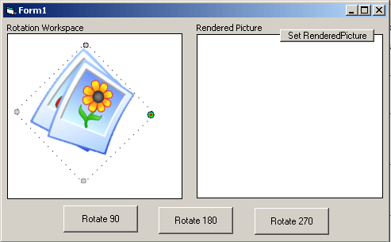



## Psuedo Object Rotation \(like msWord and Photoshop\)

### Description

This code shows how to simply allow a user to interactively rotate an image in the manner that applications like MS word and adobe photoshop do (sort of).

' This code takes in to consideration three main concepts provided by other authors and

' extends their concepts together, namely

'  Steve McMahon Vbaccelerator.com - His code for DIB Processing and Region Mapping is superb fast and without his site, many of us would still be stuck on our first application! Thanks Steve

'  Zubuyer kaolin - His PsCode example on rotation (dial i believe) was used for most of the rotation logic, but was modified to handle the rotation point differently (top right as opposed to the center)

'  Florian Egal - His excellent library found on PSCode is the best! If you do not have this file (FoxCBmp3.dl is included in the zip) you will need to do a search on planetsourcecode for florian egal or advanced graphics 3.3 on copy the file to your sys32 directory.

'' If any one else sees any code that I did not mark as being theirs, please let me know and i will be happy to add their name.

''''Note, this code is not optimized....and is also a very small part of a much bigger project

'''' so there is a lot of code in here that is not really needed for the sake of this example, but i am not ripping it out to due time restrictions

'''' regardless, I though this was kinda neat so i thought i would share it with th vb community.

'''' Obviously, there needs some work on the rotation logic, as it is a little quirky but , you know.....
 
### More Info
 

             |
---                |---
**Submitted On**   |2003-10-30 18:50:48
**By**             |[Ray Hildenbrand](https://github.com/Planet-Source-Code/PSCIndex/blob/master/ByAuthor/ray-hildenbrand.md)
**Level**          |Intermediate
**User Rating**    |4.8 (19 globes from 4 users)
**Compatibility**  |VB 6\.0
**Category**       |[Graphics](https://github.com/Planet-Source-Code/PSCIndex/blob/master/ByCategory/graphics__1-46.md)
**World**          |[Visual Basic](https://github.com/Planet-Source-Code/PSCIndex/blob/master/ByWorld/visual-basic.md)
**Archive File**   |[Psuedo\_Obj16650810302003\.zip](https://github.com/Planet-Source-Code/ray-hildenbrand-psuedo-object-rotation-like-msword-and-photoshop__1-49546/archive/master.zip)

